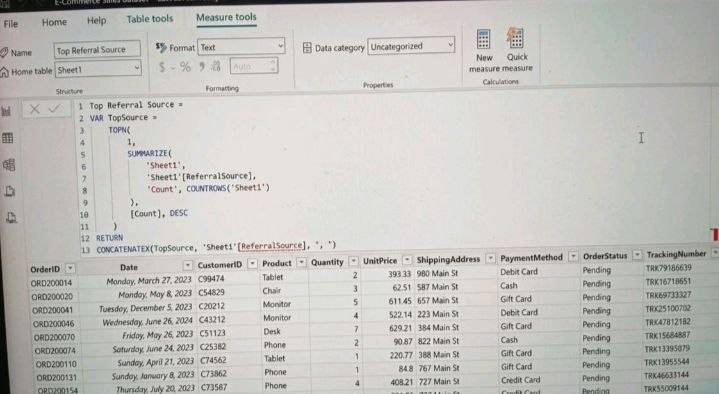
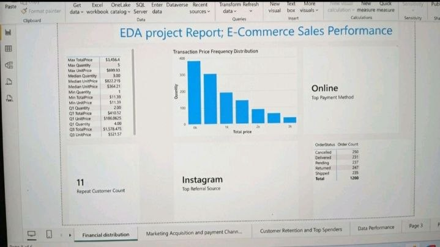

# Task 2: Exploratory Data Analysis (EDA)

## Project Artifacts & Documentation

### 1. DAX Implementation Logic

Technical Note: This image documents the implementation of a custom DAX measure, Top Referral Source. I utilized SUMMARIZE and TOPN functions to dynamically identify the highest-performing channel from the dataset.

### 2. EDA Dashboard Overview

Technical Note: This snapshot displays the summary dashboard of the E-Commerce Sales Performance report. Key highlights include:
*   Statistical Baseline: Utilization of calculated statistical metrics for price and quantity.
*   Data Visualization: Implementation of a histogram for Transaction Price Frequency Distribution to visualize data skewness.
*   KPI Integration: Use of dedicated KPI cards for high-level metrics like Repeat Customer Count.
